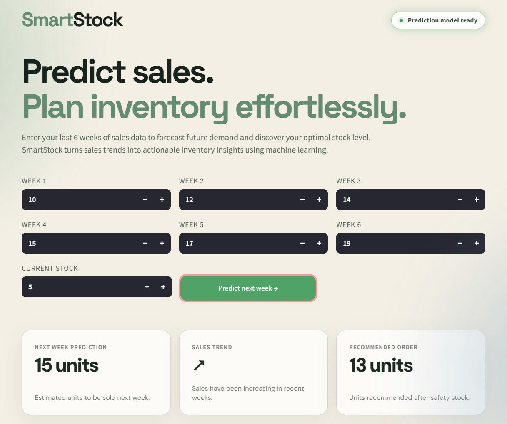
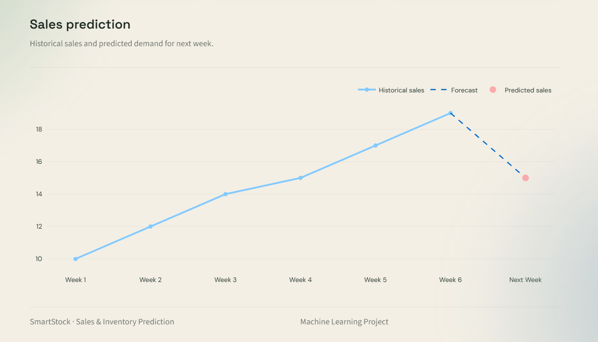

# SmartStock

SmartStock is a machine learning-based sales forecasting and inventory planning application.

It uses the last six weeks of sales data to predict next week's demand, analyze recent sales trends, and recommend an order quantity based on predicted demand and current stock.

## Application





## Features

* Next-week sales prediction
* Sales trend analysis
* Recommended order quantity
* Safety stock calculation
* Historical sales and forecast visualization
* Interactive Streamlit interface
* Regression model comparison

## How It Works

SmartStock takes six weeks of historical sales data and a sales trend feature as input.

```text
6 Weeks of Sales + Sales Trend
             ↓
      Machine Learning Model
             ↓
       Next Week Prediction
             ↓
      + Safety Stock (20%)
             ↓
        - Current Stock
             ↓
       Recommended Order
```

The application uses a safety stock level equal to 20% of the predicted demand.

## Machine Learning

The project compares three regression models:

| Model             |    MAE |     R² |
| ----------------- | -----: | -----: |
| Gradient Boosting | 2.0690 | 0.9084 |
| Random Forest     | 2.1311 | 0.9035 |
| Linear Regression | 2.0645 | 0.9069 |

The final Streamlit application uses a **Gradient Boosting Regressor** for demand prediction.

### Input Features

The model uses seven features:

* Week 1 sales
* Week 2 sales
* Week 3 sales
* Week 4 sales
* Week 5 sales
* Week 6 sales
* Sales trend

### Model Evaluation

The dataset was divided into training and test samples using a time-based approach.

* Training samples: **24,330**
* Test samples: **4,055**
* Evaluation metrics: **MAE** and **R²**

## Dataset

The project uses the **Sales Transactions Dataset Weekly**.

The dataset contains weekly sales information for multiple products.

Dataset location:

```text
data/Sales_Transactions_Dataset_Weekly.csv
```

## Project Structure

```text
SmartStock/
│
├── data/
│   └── Sales_Transactions_Dataset_Weekly.csv
│
├── images/
│   ├── smartstock-dashboard.png
│   └── smartstock-chart.png
│
├── app.py
├── train_model.py
├── model_comparison.py
├── user_terminal.py
├── smartstock_model.pkl
├── requirements.txt
├── README.md
└── .gitignore
```

## Installation

Clone the repository:

```bash
git clone https://github.com/azradrnn/SmartStock.git
cd SmartStock
```

Create a virtual environment:

```bash
python -m venv .venv
```

Activate the virtual environment on Windows:

```bash
.venv\Scripts\activate
```

Install the required packages:

```bash
pip install -r requirements.txt
```

## Run the Application

Start the Streamlit application:

```bash
streamlit run app.py
```

The application will open in your browser.

## Train the Model

To retrain the model using the dataset:

```bash
python train_model.py
```

This will generate a new:

```text
smartstock_model.pkl
```

## Model Comparison

To compare the regression models:

```bash
python model_comparison.py
```

The script evaluates:

* Gradient Boosting Regressor
* Random Forest Regressor
* Linear Regression

using Mean Absolute Error (MAE) and R² Score.

## Technologies

* Python
* Pandas
* Scikit-learn
* Streamlit
* Plotly
* Joblib

## Project Goal

SmartStock demonstrates how machine learning can be used to support demand forecasting and inventory planning using historical sales data.

The project combines demand prediction, sales trend analysis, and inventory recommendations in a simple interactive application.
